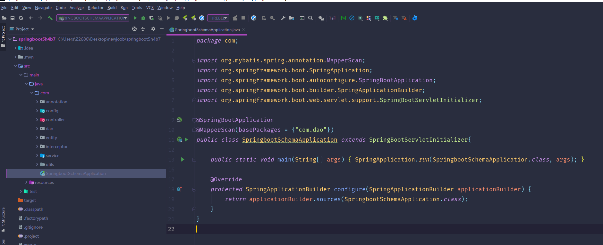
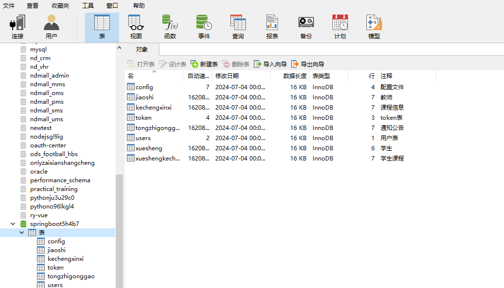
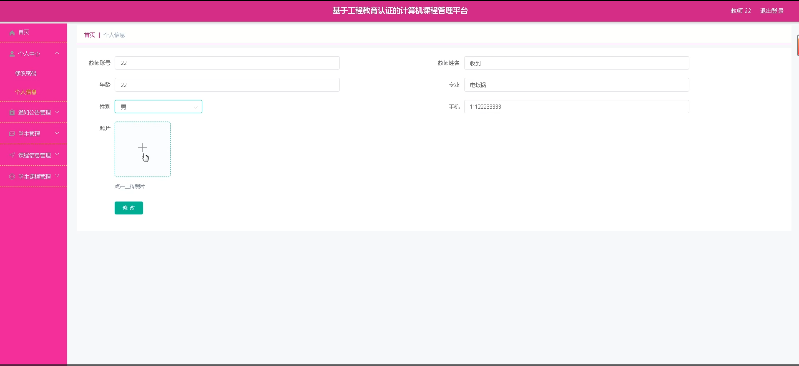
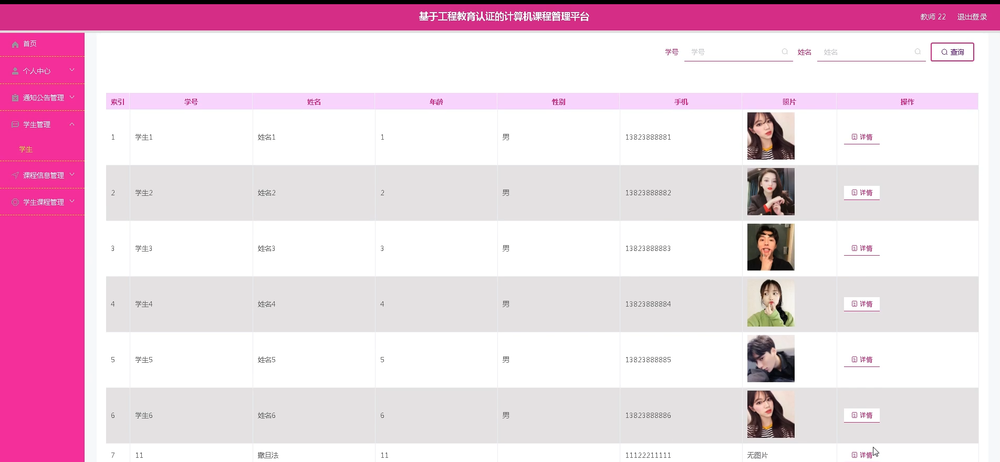
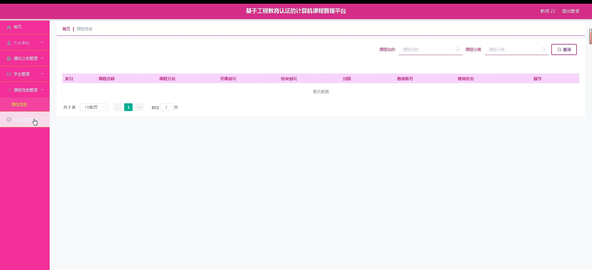
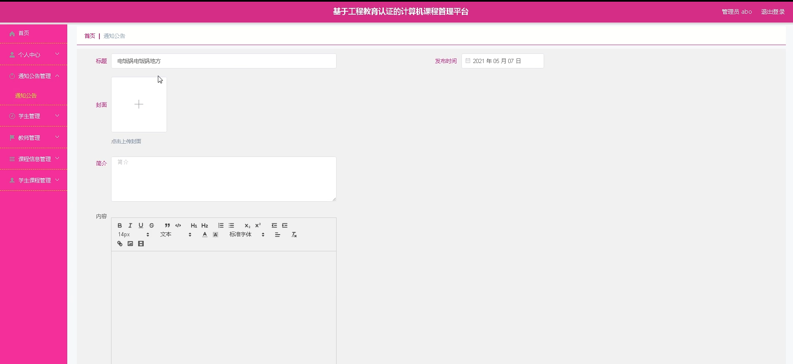
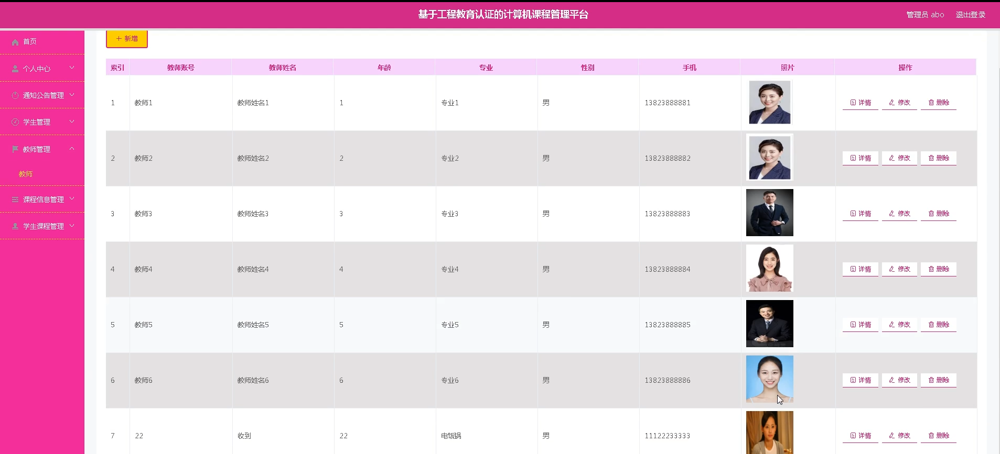
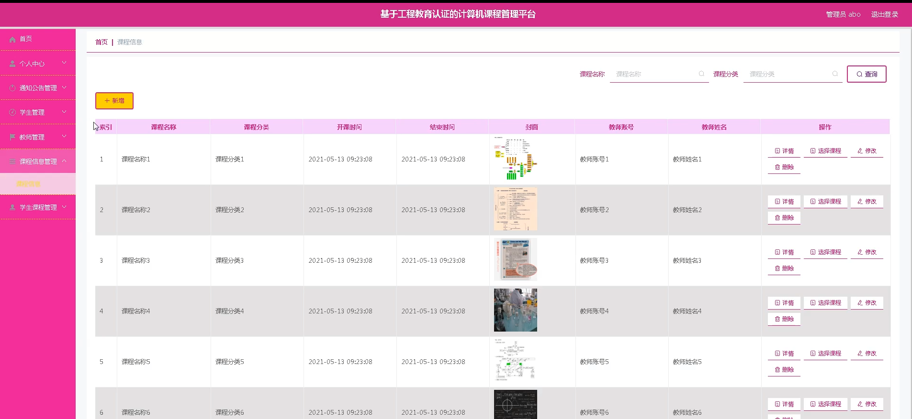
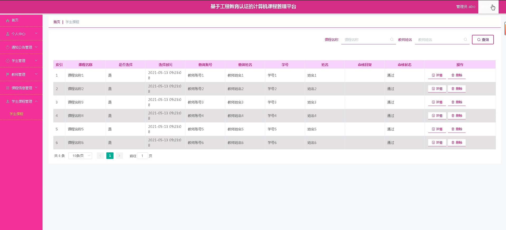
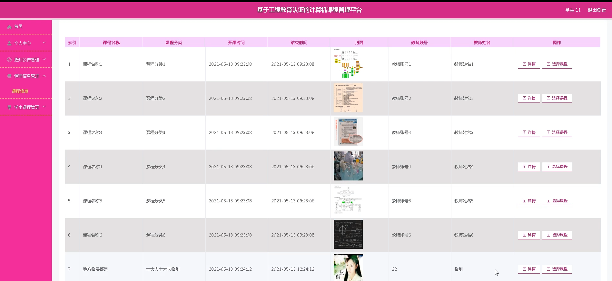

# 基于工程教育认证+java的计算机课程管理平台

<h4 style='color:red'>联系不到我，就看我的主页 </h4> 
 
#### 介绍

在工程教育认证的背景下，为了更好地管理和优化计算机课程的教学过程，提高教学质量，我们开发了这个专门的课程管理平台。该平台旨在为管理端、教师端和学生端提供一体化的服务，促进教学资源的合理配置和教学活动的高效开展。

#### 技术栈

后端技术栈：Springboot+Mysql+Maven

前端技术栈：Vue+Html+Css+Javascript+ElementUI

开发工具：Idea+Vscode+Navicate

#### 系统功能介绍

（一）管理端   
个人中心：管理端用户可以在此查看和修改个人信息，接收重要的系统通知和消息。  
通知公告管理：发布与课程相关的通知、公告，如课程调整、考试安排、教学活动通知等。可以设置通知的发布范围、优先级和有效期，确保信息准确传达给相关人员。  
学生管理：全面管理学生的信息，包括学生的基本资料、选课情况、学习成绩等。能够对学生进行注册、学籍异动处理、成绩录入和统计分析。  
教师管理：负责教师的信息管理，包括教师的个人资料、授课安排、教学评价等。可以进行教师的招聘、调配和考核等操作。  
课程信息管理：创建、编辑和维护计算机课程的详细信息，包括课程名称、课程代码、课程简介、教学大纲、教材选用等。能够设置课程的先修课程、学分、学时等参数。  
学生课程管理：对学生的选课情况进行管理，包括选课审批、课程退选处理、课程冲突检测等。可以查看学生的课程学习进度和成绩分布。  

（二）教师端  
个人中心：教师在此可以修改个人资料，查看教学任务安排和通知消息。  
通知公告管理：接收和查看管理端发布的通知公告，同时也可以向所授课程的学生发布与课程相关的通知。  
学生管理：查看所授课程学生的名单和基本信息，了解学生的学习情况和表现，对学生进行考勤管理和成绩评定。  
课程信息管理：查看和编辑所授课程的详细信息，上传教学资料、课件和作业等。可以根据教学需要调整课程内容和教学方法。  
学生课程管理：查看学生的选课情况，审核学生的课程作业和项目，记录学生的平时成绩和考试成绩。 
 
（三）学生端  
个人中心：学生可以修改个人信息，查看课程安排和成绩情况。  
通知公告管理：及时获取学校和教师发布的通知公告，了解课程和教学的最新动态。  
课程信息管理：查看所学课程的详细信息，包括课程大纲、教学要求、授课教师等。下载课程相关的学习资料和作业。  
学生课程管理：进行课程的选课、退课操作，查看课程的学习进度和成绩，提交课程作业和项目。  
#### 系统作用

提高教学管理效率  
为管理端提供了集中、便捷的管理工具，实现了对学生、教师和课程的全面管理，大大减少了繁琐的人工操作，提高了管理效率和决策的科学性。  
优化教学资源配置  
通过对课程信息和学生选课情况的管理，能够合理安排教学资源，避免课程冲突和资源浪费，提高资源的利用效率。  
促进教学质量提升  
教师可以更好地组织教学活动，根据学生的学习情况进行针对性的教学调整。学生能够更清晰地了解课程要求和学习目标，提高学习的主动性和积极性。  
增强师生互动与沟通  
通知公告功能和课程管理模块为师生之间的信息传递和交流提供了便利，有助于及时解决教学过程中出现的问题，营造良好的教学氛围。  
保障工程教育认证的顺利实施  
系统的各项功能和数据管理符合工程教育认证的要求，能够为认证工作提供有力的支持和数据依据。  

#### 系统功能截图

代码结构

数据库表

登录

教师端个人信息

学生管理

课程信息管理

管理员端通知公告

教师管理

课程信息

学生课程管理

学生端课程信息

#### 总结

基于工程教育认证的计算机课程管理平台通过明确的角色分工和丰富实用的功能模块，实现了计算机课程教学管理的信息化、规范化和科学化。它不仅为管理端、教师端和学生端提供了便捷的服务，也为提高计算机课程的教学质量和推进工程教育认证工作发挥了重要作用。未来，随着教育理念的不断更新和技术的持续进步，该平台将不断完善和优化，以更好地满足工程教育的发展需求。

#### 使用说明

创建数据库，执行数据库脚本 修改jdbc数据库连接参数 下载安装maven依赖jar 启动idea中的springboot项目

后台地址
http://localhost:8080/springboot5h4b7/admin/dist/index.html

管理员  abo 密码 abo
